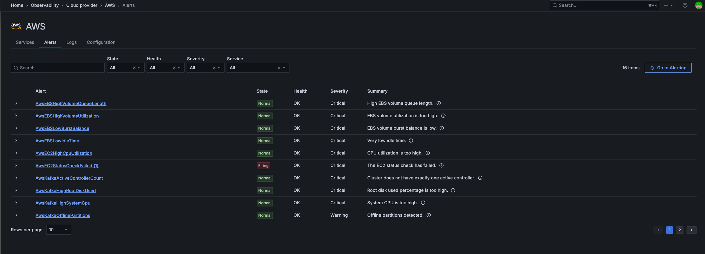

# aws-workshop-emeria

[awsworkshopemeria.grafana.net](https://awsworkshopemeria.grafana.net/)

Prerequisites: [terraform](https://developer.hashicorp.com/terraform/tutorials/aws-get-started/install-cli), [aws-cli](https://docs.aws.amazon.com/cli/latest/userguide/getting-started-install.html)

## Setup

### IAM Role

- [Terraform config instructions (docs)](https://grafana.com/docs/grafana-cloud/monitor-infrastructure/monitor-cloud-provider/aws/cloudwatch-metrics/terraform-config/)
- Home > Observability > Cloud provider > AWS > Configuration > AWS accounts > Create new account


Copy output in `terraform/role.tf`

### Scrape job

- Home > Observability > Cloud provider > AWS > Configuration > CloudWatch metrics > Create new scrape job

And "Export as Terraform"


Copy output in `terraform/scrape-job.tf`

See [cloud_provider_aws_cloudwatch_scrape_job docs](https://registry.terraform.io/providers/grafana/grafana/latest/docs/resources/cloud_provider_aws_cloudwatch_scrape_job)

### Grafana Cloud authentication

- [Configure Grafana Cloud authentication](https://grafana.com/docs/grafana-cloud/monitor-infrastructure/monitor-cloud-provider/aws/cloudwatch-metrics/terraform-config/#configure-grafana-cloud-authentication)


Then, e.g.:
```sh
❯  curl -sH "Authorization: Bearer <Access Token from previous step>" "https://grafana.com/api/instances" | \
 jq '[.items[]|{stackName: .slug, clusterName:.clusterSlug, cloudProviderAPIURL: "https://cloud-provider-api-\(.clusterSlug).grafana.net"}]'
[
  {
    "stackName": "awsworkshopemeria",
    "clusterName": "prod-eu-north-0",
    "cloudProviderAPIURL": "https://cloud-provider-api-prod-eu-north-0.grafana.net"
  }
]
```

Either use `GRAFANA_CLOUD_PROVIDER_URL` / `GRAFANA_CLOUD_PROVIDER_ACCESS_TOKEN` env variables or [configure the Terraform provider](https://grafana.com/docs/grafana-cloud/monitor-infrastructure/monitor-cloud-provider/aws/cloudwatch-metrics/terraform-config/#configure-the-grafana-terraform-provider).

### Apply terraform

Get `external_id` from the username / instance ID for your Grafana Cloud Prometheus. Also available in Grafana Cloud under AWS "Create new account" page details.

```sh
export GRAFANA_CLOUD_PROVIDER_URL="<Cloud Provider API URL from previous step>"
export GRAFANA_CLOUD_PROVIDER_ACCESS_TOKEN="<Access Token from previous step>"
export AWS_ACCESS_KEY_ID="YOUR_AWS_ACCESS_KEY_ID"
export AWS_SECRET_ACCESS_KEY="YOUR_AWS_SECRET_ACCESS_KEY"

cd terraform

terraform init
terraform apply
```

### Install dashboards and alerts

- Home > Observability > Cloud provider > AWS > Configuration


### Check resources

- Home > Observability > Cloud provider > AWS > Services


- Home > Observability > Cloud provider > AWS > Alerts


## Cleanup

```sh
terraform destroy
```
